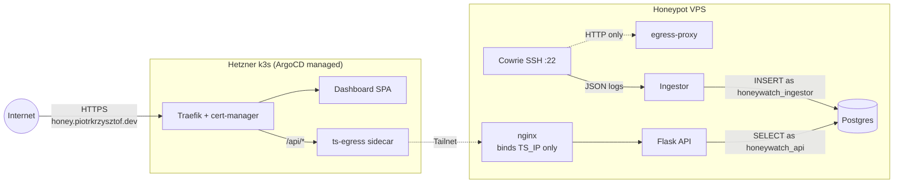

<p align="center">
  
</p>

<div align="center">

[Live dashboard](https://honey.piotrkrzysztof.dev) &middot; [Documentation](https://docs.honeywatch.piotrkrzysztof.dev)

[](https://github.com/straightchlorine/honeywatch/actions/workflows/ci.yml)
[](https://github.com/straightchlorine/honeywatch/releases)
[](https://github.com/straightchlorine?tab=packages&repo_name=honeywatch)

SSH honeypot with attack visualization and threat analysis.

</div>

<p align="center">
  <a href="https://honey.piotrkrzysztof.dev">
    
  </a>
</p>

## Architecture


```mermaid
graph LR
    subgraph honeypot["Honeypot VPS"]
        Cowrie[Cowrie SSH :22] -.->|HTTP only| Egress[egress-proxy]
        Cowrie -->|JSON logs| Ingestor
        Ingestor -->|INSERT as honeywatch_ingestor| PG[(Postgres)]
        API[Flask API] -->|SELECT as honeywatch_api| PG
        Nginx[nginx<br/>binds TS_IP only] --> API
    end

    subgraph k3s["Hetzner k3s (ArgoCD managed)"]
        Traefik[Traefik + cert-manager] --> Dashboard[Dashboard SPA]
        Traefik -->|/api/*| TSE[ts-egress sidecar]
    end

    Net((Internet)) -->|HTTPS<br/>honey.piotrkrzysztof.dev| Traefik
    TSE -.->|Tailnet| Nginx
```

The honeypot VPS runs Cowrie, ingestor, Postgres, Flask API,
and an internal nginx that binds only to the Headscale tailnet interface.

Cowrie has no direct internet egress; outbound traffic is forced through
a tinyproxy sidecar (`egress-proxy`).

The dashboard routes `/api/*` through a Tailscale egress pod across the tailnet
to the honeypot's nginx. All k8s manifests, including the ArgoCD `Application`,
live in `k8s/`.

<div align="center">

<table>
  <tr><th></th><th>Health</th><th>Uptime (24h)</th></tr>
  <tr>
    <td>Dashboard</td>
    <td align="center"><a href="https://status.codextechnologies.org/endpoints/external_honeywatch-dashboard"></a></td>
    <td align="center"><a href="https://status.codextechnologies.org/endpoints/external_honeywatch-dashboard"></a></td>
  </tr>
  <tr>
    <td>API</td>
    <td align="center"><a href="https://status.codextechnologies.org/endpoints/external_honeywatch-api"></a></td>
    <td align="center"><a href="https://status.codextechnologies.org/endpoints/external_honeywatch-api"></a></td>
  </tr>
</table>

</div>

## What It Does

- Runs a Cowrie SSH honeypot that captures brute-force attempts
- Captures SSH client intel: client HASSH, offered public-key fingerprints, and
  direct-tcpip (port-forward / relay) attempts for clustering and threat analysis
- Ingests Cowrie's JSON event log into PostgreSQL
- Analyses captured credentials: top username/password pairs, distributed-botnet IP fan-out, password length/charset composition, and Cowrie accept-rate
- Serves a Vue 3 dashboard
- Exposes a public read-only REST API (Flask + flask-smorest, OpenAPI 3.1)

## Running Locally

Prerequisites: Docker, [just](https://github.com/casey/just), [uv](https://docs.astral.sh/uv/), pnpm 10.x.

```bash
cp .env.example .env
just dev          # bring up the full stack (build + detached)
just logs         # tail logs; `just logs api ingestor` to filter
just attack       # SSH into cowrie on :2222 to generate events
just down         # stop the stack
```

### Dashboard development

```bash
just pnpm dev               # Vite dev server on http://localhost:5173
just pnpm test --coverage   # vitest run
just pnpm e2e               # playwright (preview server on :4173, axe smoke)
just openapi-regen          # regenerate api/openapi.json + dashboard TS SDK
```

See `justfile` for the full command list.

## Documentation

Full docs at <https://docs.honeywatch.piotrkrzysztof.dev>. Build
them locally with:

```bash
uv run --with-requirements docs/requirements.txt mkdocs serve
```

## URLs

- Dashboard: http://localhost:8080
- API: http://localhost:5000 (docs at `/api/v1/swagger` and `/api/v1/redoc`)

## Attributions

This product includes GeoLite Data created by MaxMind, available from https://www.maxmind.com.

Country boundaries are made with Natural Earth.
