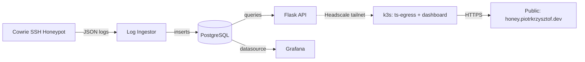

# Honeywatch

SSH honeypot with real-time attack visualization and threat analysis.

|           | Health | Uptime (24h) |
|-----------|:------:|:------------:|
| Dashboard | [](https://status.codextechnologies.org/endpoints/external_honeywatch-dashboard) | [](https://status.codextechnologies.org/endpoints/external_honeywatch-dashboard) |
| API       | [](https://status.codextechnologies.org/endpoints/external_honeywatch-api) | [](https://status.codextechnologies.org/endpoints/external_honeywatch-api) |

## Architecture


```mermaid
graph LR
    A[Cowrie SSH Honeypot] -->|JSON logs| B[Log Ingestor]
    B -->|inserts| C[(PostgreSQL)]
    C -->|queries| D[Flask API]
    D -.->|Headscale tailnet| E[k3s: ts-egress + dashboard]
    E -->|HTTPS| F[Public: honey.piotrkrzysztof.dev]
    C -->|datasource| G[Grafana]
```

The honeypot VPS runs Cowrie, Postgres, the ingestor, the Flask API, and Grafana. It joins a Headscale tailnet and binds its internal nginx to the tailnet interface only, so the API is never reachable from the public internet directly.

A Hetzner k3s cluster runs a Tailscale egress sidecar (reached at `honey.piotrkrzysztof.dev/api/*`) and serves the dashboard SPA at `/`. Public access goes Internet -> Traefik -> {dashboard Service | honeypot-api Service -> ts-egress pod -> tailnet -> honeypot}.

Cluster manifests live in [straightchlorine/fleet](https://codeberg.org/piotrkrzysztof/fleet) under `clusters/hetzner/honeywatch/`.

## What It Does

- Runs a Cowrie SSH honeypot that captures brute-force attempts
- Ingests logs into PostgreSQL
- Serves a Vue 3 dashboard with an IP geolocation map, login attempt timeline, top credentials used by bots, and attack frequency stats
- Exposes a public read-only REST API (Flask + flask-smorest, OpenAPI 3.1)
- Grafana wired in as a Postgres query UI for ad-hoc exploration

## Stack

- Cowrie (SSH honeypot)
- PostgreSQL
- Python (Flask API + log ingestor)
- Vue 3 (dashboard, deployed via k3s)
- Grafana
- Docker Compose (honeypot VPS)
- Kubernetes (k3s on Hetzner, managed via ArgoCD)
- GitHub Actions (CI/CD)

## Running Locally

```bash
cp .env.example .env
just dev          # bring up the full stack (build + detached)
just logs         # tail logs; `just logs api ingestor` to filter
just attack       # SSH into cowrie on :2222 to generate events
just down         # stop the stack
```

See `justfile` for the full command list.

## URLs

- Dashboard: http://localhost:8080
- API: http://localhost:5000 (browse `/api/v1/swagger` for the interactive spec)
- Grafana: http://localhost:3000

## OpenAPI

Spec served at `/api/v1/openapi.json`. Interactive UIs:

- Swagger UI: `/api/v1/swagger` (proxy redirects `/swagger` to it)
- Redoc: `/api/v1/redoc` (proxy redirects `/redoc` to it)

The committed `api/openapi.json` is the source of truth for the dashboard
TypeScript SDK. When you change a route or marshmallow schema:

```bash
just openapi-regen   # `flask openapi-dump` + dashboard codegen
just check           # full local gate; runs `openapi-check` drift gate
```

CI fails if `api/openapi.json` is out of date. Conventions: see
[docs/api-style.md](docs/api-style.md).

## Deploying (honeypot VPS)

```bash
# One-time: install tailscale and join the tailnet
curl -fsSL https://tailscale.com/install.sh | sh
sudo tailscale up --login-server=https://vpn.codextechnologies.org \
    --advertise-tags=tag:honeypot

# Note the tailnet IP, set TS_IP in .env, then:
docker compose -f docker-compose.prod.yml up -d
```

## Attributions

This product includes GeoLite Data created by MaxMind, available from https://www.maxmind.com.
