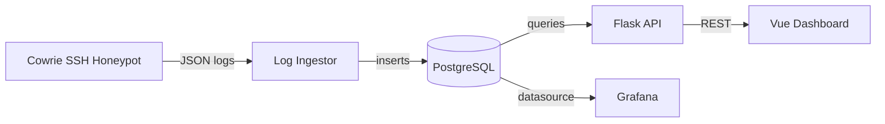

# Honeywatch

SSH honeypot with real-time attack visualization and threat analysis.

|           | Health | Uptime (24h) |
|-----------|:------:|:------------:|
| Dashboard | [](https://status.codextechnologies.org/endpoints/external_honeywatch-dashboard) | [](https://status.codextechnologies.org/endpoints/external_honeywatch-dashboard) |
| API       | [](https://status.codextechnologies.org/endpoints/external_honeywatch-api) | [](https://status.codextechnologies.org/endpoints/external_honeywatch-api) |

## Architecture


```mermaid
graph LR
    A[Cowrie SSH Honeypot] -->|JSON logs| B[Log Ingestor]
    B -->|inserts| C[(PostgreSQL)]
    C -->|queries| D[Flask API]
    D -->|REST| E[Vue Dashboard]
    C -->|datasource| F[Grafana]
```

## What It Does

- Runs a Cowrie SSH honeypot that captures brute-force attempts
- Ingests logs into PostgreSQL
- Serves a Vue 3 dashboard with an IP geolocation map, login attempt timeline, top credentials used by bots, and attack frequency stats
- Grafana wired in as a Postgres query UI for ad-hoc exploration

## Stack

Cowrie, PostgreSQL, Flask (API + ingestor), Vue 3, Grafana, Docker Compose, GitHub Actions.

## Running Locally

```bash
cp .env.example .env
just dev          # bring up the full stack (build + detached)
just logs         # tail logs; `just logs api ingestor` to filter
just attack       # SSH into cowrie on :2222 to generate events
just down         # stop the stack
```

See `justfile` for the full command list.

## URLs

- Dashboard: http://localhost:8080
- API: http://localhost:5000
- Grafana: http://localhost:3000
