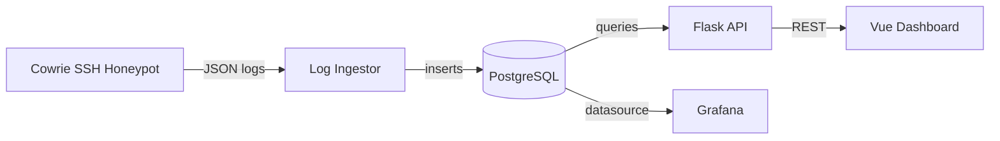

# Honeywatch

SSH honeypot with real-time attack visualization and threat analysis.

|           | Health | Uptime (24h) |
|-----------|:------:|:------------:|
| Dashboard | [](https://status.codextechnologies.org/endpoints/external_honeywatch-dashboard) | [](https://status.codextechnologies.org/endpoints/external_honeywatch-dashboard) |
| API       | [](https://status.codextechnologies.org/endpoints/external_honeywatch-api) | [](https://status.codextechnologies.org/endpoints/external_honeywatch-api) |

## Architecture


```mermaid
graph LR
    A[Cowrie SSH Honeypot] -->|JSON logs| B[Log Ingestor]
    B -->|inserts| C[(PostgreSQL)]
    C -->|queries| D[Flask API]
    D -->|REST| E[Vue Dashboard]
    C -->|datasource| F[Grafana]
```

## What It Does

- Runs a Cowrie SSH honeypot that captures brute-force attempts
- Ingests logs into PostgreSQL
- Shows a React dashboard with:
  - IP geolocation map
  - Login attempt timeline
  - Top passwords and usernames used by bots
  - Attack frequency stats
- Grafana dashboards for monitoring

## Stack

- Cowrie (SSH honeypot)
- PostgreSQL
- Python (Flask API + log ingestor)
- Vue 3 (dashboard)
- Grafana (monitoring)
- Docker Compose
- GitHub Actions (CI/CD)

## Running Locally

```bash
cp .env.example .env
docker compose up -d
```
