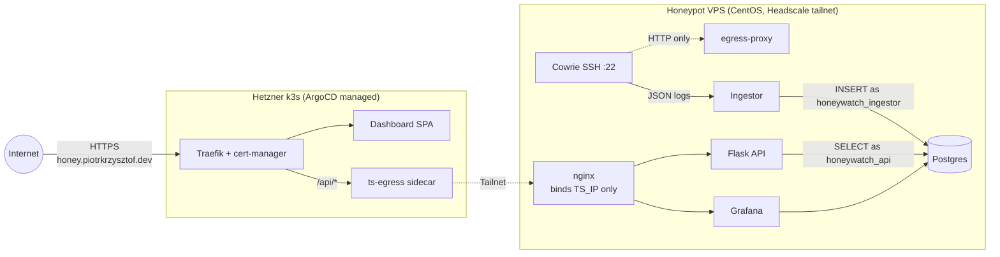

# Honeywatch

SSH honeypot with real-time attack visualization and threat analysis.

|           | Health | Uptime (24h) |
|-----------|:------:|:------------:|
| Dashboard | [](https://status.codextechnologies.org/endpoints/external_honeywatch-dashboard) | [](https://status.codextechnologies.org/endpoints/external_honeywatch-dashboard) |
| API       | [](https://status.codextechnologies.org/endpoints/external_honeywatch-api) | [](https://status.codextechnologies.org/endpoints/external_honeywatch-api) |

## Architecture


```mermaid
graph LR
    subgraph honeypot["Honeypot VPS (CentOS, Headscale tailnet)"]
        Cowrie[Cowrie SSH :22] -.->|HTTP only| Egress[egress-proxy]
        Cowrie -->|JSON logs| Ingestor
        Ingestor -->|INSERT as honeywatch_ingestor| PG[(Postgres)]
        API[Flask API] -->|SELECT as honeywatch_api| PG
        Grafana --> PG
        Nginx[nginx<br/>binds TS_IP only] --> API
        Nginx --> Grafana
    end

    subgraph k3s["Hetzner k3s (ArgoCD managed)"]
        Traefik[Traefik + cert-manager] --> Dashboard[Dashboard SPA]
        Traefik -->|/api/*| TSE[ts-egress sidecar]
    end

    Net((Internet)) -->|HTTPS<br/>honey.piotrkrzysztof.dev| Traefik
    TSE -.->|Tailnet| Nginx
```

The honeypot VPS runs Cowrie, the ingestor, Postgres, the
Flask API, Grafana, and an internal nginx that binds only to the Headscale
tailnet interface.

Cowrie has no direct internet egress; outbound traffic is forced through
a tinyproxy sidecar (`egress-proxy`).

The dashboard routes `/api/*` through a Tailscale egress pod across the tailnet
to the honeypot's nginx. All k8s manifests, including the ArgoCD `Application`,
live in `k8s/`.

## What It Does

- Runs a Cowrie SSH honeypot that captures brute-force attempts
- Ingests Cowrie's JSON event log into PostgreSQL
- Serves a Vue 3 dashboard
- Exposes a public read-only REST API (Flask + flask-smorest, OpenAPI 3.1)
- Grafana wired in as a Postgres query UI for ad-hoc exploration and metrics

## Running Locally

Prerequisites: Docker, [just](https://github.com/casey/just), [uv](https://docs.astral.sh/uv/), pnpm 10.x.

```bash
cp .env.example .env
just dev          # bring up the full stack (build + detached)
just logs         # tail logs; `just logs api ingestor` to filter
just attack       # SSH into cowrie on :2222 to generate events
just down         # stop the stack
```

See `justfile` for the full command list.

### Dashboard development

Iterating on the Vue 3 dashboard outside the docker compose stack:

```bash
just dev-dashboard          # Vite dev server on http://localhost:5173
just test-dashboard-unit    # vitest run
just test-dashboard-e2e     # playwright (preview server on :4173, axe smoke)
just openapi-regen          # regenerate api/openapi.json + dashboard TS SDK
```

## URLs

- Dashboard: http://localhost:8080
- API: http://localhost:5000 (docs at `/api/v1/swagger`)
- Grafana: http://localhost:3000

## OpenAPI

Spec served at `/api/v1/openapi.json`. Interactive UIs:

- Swagger UI: `/api/v1/swagger` (proxy redirects `/swagger` to it)
- Redoc: `/api/v1/redoc` (proxy redirects `/redoc` to it)

The committed `api/openapi.json` is the source of truth for the dashboard
TypeScript SDK. When you change a route or marshmallow schema:

```bash
just openapi-regen   # `flask openapi-dump` + dashboard codegen
just check           # full local gate; runs `openapi-check` drift gate
```

## Attributions

This product includes GeoLite Data created by MaxMind, available from https://www.maxmind.com.
