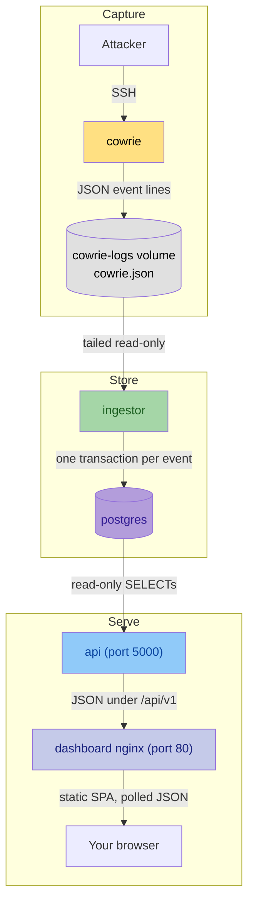
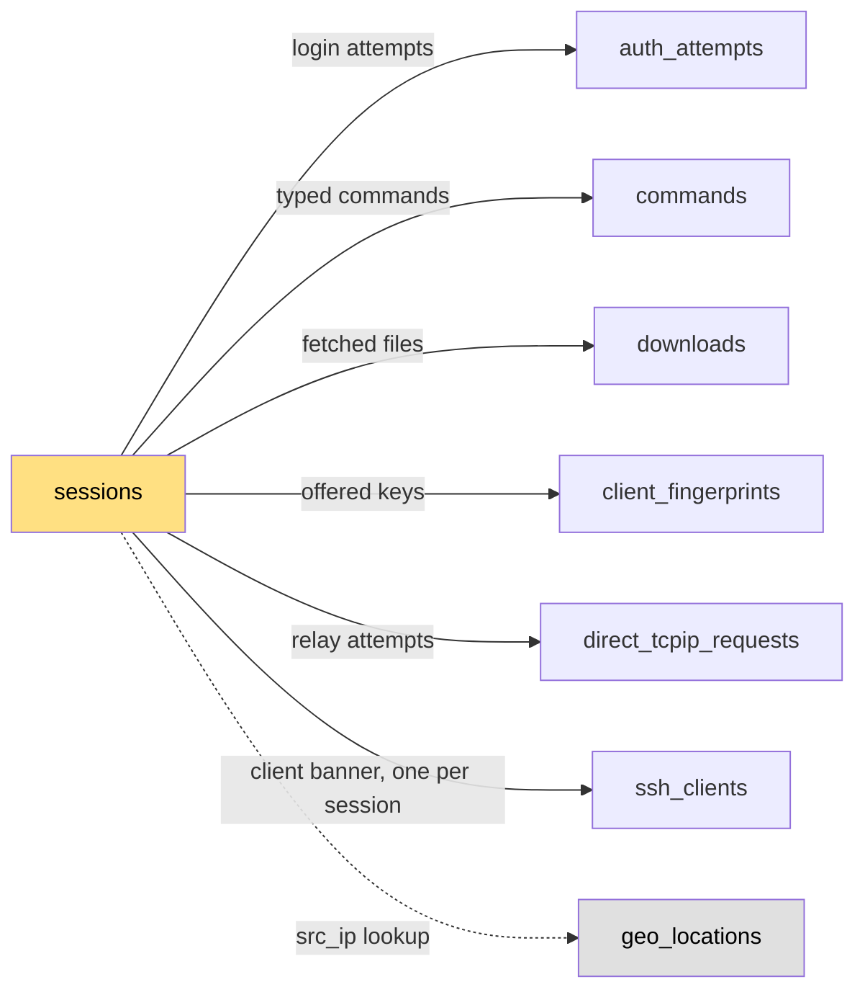

# How It Works

Honeywatch is five containers on one Docker bridge network. Each one does a
single job and hands off through a file or a database table, so every stage
can be inspected on its own.

## The Pipeline

1. An attacker connects. Cowrie completes the handshake, presents a fake
   CentOS shell, and never executes anything typed into it.
2. Cowrie appends one JSON object per event to `cowrie.json` in the
   `cowrie-logs` volume.
3. The ingestor mounts that volume read-only at `/logs`, tails the file, and
   parses each line into a typed event.
4. Each event becomes one transaction in Postgres: an insert into a child table
   plus a counter bump on the parent `sessions` row.
5. The API serves read-only aggregates under `/api/v1`.
6. The dashboard is a static build served by its own nginx, which also proxies
   `/api` to the API container. The browser re-fetches on a per-page timer.

| Container | Listens on | Published by `docker-compose.yml` |
| --- | --- | --- |
| cowrie | 2222 | `2222:2222` |
| postgres | 5432 | `${POSTGRES_HOST_PORT:-5433}:5432` |
| ingestor | nothing | none |
| api | 5000 | `5000:5000` |
| dashboard | 80 | `8080:80` |

None of those mappings names an interface, so all four bind `0.0.0.0`. Which
of them should reach the internet is the subject of the
[Self-Hosting](../self-hosting/index.md) section.

## Cowrie

The honeypot itself, pulled as the pinned image `cowrie/cowrie:sha-cd0770d`.
It emulates a shell rather than providing one: commands are answered from a
pickled fake filesystem and canned output, so nothing an attacker types runs
on your host. Telnet is disabled.

| | |
| --- | --- |
| Reads | `cowrie.cfg`, `userdb.txt`, the filesystem pickle, `cmdoutput.json`, `honeyfs/`, `txtcmds/`, all bind-mounted from the repo |
| Writes | `cowrie.json` and `cowrie.log` into the `cowrie-logs` volume; host keys and captured uploads into an anonymous volume on `var/` |
| Exposes | 2222 inside the container |

The persona is a neglected CentOS Stream 10 box: hostname `centos`, kernel
`6.12.0-116.el10.x86_64`, banner `SSH-2.0-OpenSSH_9.8p1 RHEL10`. Logins are
checked against `cowrie/userdb.txt`, an allowlist of about thirty pairs with a
catch-all reject at the end.

Downloads are capped at 10 MB each. Captured binaries land in Cowrie's state
directory, which `docker-compose.yml` leaves on an anonymous volume: it
survives a recreate but not `docker compose down`. Their hashes and URLs are
in Postgres and survive either way.

## Ingestor

A Python service with no HTTP surface. One thread tails `/logs/cowrie.json`;
another parses each line and writes it. The queue between them holds 10,000
lines, so when Postgres is slow the tailer blocks instead of growing without
limit.

| | |
| --- | --- |
| Reads | `/logs/cowrie.json`, plus `GeoLite2-City.mmdb` and `GeoLite2-ASN.mmdb` from `/data/geoip` |
| Writes | Rows in Postgres, and a liveness file at `/tmp/healthy` |
| Exposes | Nothing by default. With `METRICS_ENABLED=1`, Prometheus metrics on `127.0.0.1:9101` inside the container |

It handles eleven Cowrie event ids:

| Event id | What it writes |
| --- | --- |
| `cowrie.session.connect` | A `sessions` row, plus a `geo_locations` upsert |
| `cowrie.login.success` | An `auth_attempts` row, sets `sessions.auth_success` |
| `cowrie.login.failed` | An `auth_attempts` row |
| `cowrie.command.input` | A `commands` row, increments `sessions.n_commands` |
| `cowrie.session.file_download` | A `downloads` row, increments `sessions.n_downloads` |
| `cowrie.session.file_download.failed` | A `downloads` row with a null `sha256`, kept for the URL |
| `cowrie.session.closed` | Sets `sessions.ended_at` |
| `cowrie.client.version`, `cowrie.client.kex` | Upsert the `ssh_clients` row |
| `cowrie.client.fingerprint` | A `client_fingerprints` row |
| `cowrie.direct-tcpip.request` | A `direct_tcpip_requests` row, increments `sessions.n_tcpip` |

Everything else is dropped, including `cowrie.command.success` and
`cowrie.command.failed`, which is why nothing reports whether a command
succeeded. Child events whose `session.connect` was never seen are dropped
too.

There is no batching. Each event is its own transaction, so a bad line cannot
poison a batch. `session.connect` uses two: the `sessions` row commits first,
then the geo upsert, so a failed lookup never rolls back the session.

Without the MaxMind files the ingestor logs one warning and continues
unenriched. Database failures are retried three times; after 50 consecutive
failures the ingestor stops and probes Postgres on a backoff, keeping
`/tmp/healthy` fresh so the container stays healthy through the outage.
Events that exhausted their retries are logged and lost.

## Database Schema

Eight tables. `sessions` is the hub; six tables hang off it by `session_id`
with `ON DELETE CASCADE`, and `geo_locations` stands apart, keyed on the IP.

`sessions` carries the connection identity and four denormalized counters:

| Column | Type | Notes |
| --- | --- | --- |
| `id` | `VARCHAR(64)` | Cowrie's session id |
| `src_ip` | `INET` | Only for joining `geo_locations`. Never serialized |
| `src_port`, `dst_ip`, `dst_port`, `protocol` | | |
| `started_at`, `ended_at` | `TIMESTAMPTZ` | `ended_at` is null until `session.closed` |
| `n_commands`, `n_downloads`, `n_tcpip` | `INTEGER` | Bumped by the ingestor |
| `auth_success` | `BOOLEAN` | |
| `interest` | `INTEGER` | Generated: `2*n_commands + 5*n_downloads + 2*n_tcpip + 3*auth_success` |

`interest` is computed by Postgres so the Sessions page can sort by "how much
did this attacker do" off an index instead of an aggregate.

Two child tables have unusual shapes. `ssh_clients` uses `session_id` as its
primary key, so there is at most one row per session and repeated
`client.version` events upsert it. `direct_tcpip_requests.dst_ip` is
`VARCHAR(256)` rather than `INET`, because attackers relay to hostnames too.

String columns are bounded (`commands.input` at 8192, `downloads.url` at 2048,
usernames and passwords at 256) as a last defence against payload bloat. The
ingestor truncates before the database bound fires.

The schema is managed by Alembic. A one-shot `api-migrate` service applies
migrations on every `docker compose up`, before the API and ingestor start.
Most index creation uses `CREATE INDEX CONCURRENTLY`, so a migration can look hung
when it is just building an index without blocking the ingestor.

**Roles.** `postgres/init.sql` defines `honeywatch_ingestor` (SELECT, INSERT,
UPDATE, DELETE) and `honeywatch_api` (SELECT only). Only
`docker-compose.prod.yml` runs that script. On `docker-compose.yml` both
services connect as the bootstrap superuser. `postgres/upgrade-roles.sql`
creates the roles on an existing data directory, but you also need an
override that hands each service its own `POSTGRES_USER` and password.

Nothing prunes old data. Rows accumulate until you delete them; deleting a
`sessions` row cascades to all six child tables.

## API

A Flask application built with `flask-smorest`, served by gunicorn with 2
workers and 4 threads. The OpenAPI 3.1 spec, Swagger UI and ReDoc are
generated from the route definitions and served from the same process.

| | |
| --- | --- |
| Reads | Postgres, over a pool of 5 connections plus 5 overflow |
| Writes | Nothing |
| Exposes | `/health` and `/health/ready` at the root, everything else under `/api/v1` |

Every route is a GET. There is no login and no write endpoint, and the only
writer in the system is the ingestor. That is the whole authorization model.

`/health` returns a static payload and never touches the database; it is what
the Docker healthcheck uses, so a database blip does not restart the API.
`/health/ready` runs `SELECT 1` and returns 503 when the database is
unreachable.

Responses carry a short `Cache-Control` window (30 seconds for most JSON, 120
for the map, 300 for a country detail) so many dashboard tabs polling at once
collapse into fewer queries. The API does no rate limiting and sends no CORS
headers; rate limiting is a reverse-proxy concern, and the missing CORS
headers are why the dashboard and API must be same-origin.

## Dashboard

A Vue 3.5 single-page application, compiled to static files at image build
time and served by nginx. The same nginx proxies `/api` to `http://api:5000`,
so the browser only ever talks to one host.

| Route | Page |
| --- | --- |
| `/` | Overview: world map, headline counters, live feed |
| `/pulse` | Activity over time: hour-by-weekday heatmap and daily columns |
| `/sessions` | Sessions explorer with filters and pagination |
| `/sessions/:id` | One session replayed command by command |
| `/credentials` | Username and password combinations, password composition |
| `/origins` | Hex cartogram of source countries, networks and SSH clients |
| `/payloads` | Captured files, hashes and where they were fetched from |

The TypeScript SDK in `dashboard/src/api/generated` is generated from
`api/openapi.json` and committed, so the dashboard build never needs a running
API. CI fails if the two drift.

## Four Guarantees

**No IP address is ever served.** `sessions.src_ip` exists only to join
`geo_locations`. Attacker-controlled text that might contain an address
(commands, download URLs, usernames, passwords, client banners) passes through
`redact_ips`, which replaces IPv4 and IPv6 literals with `<ip>`. The pattern
uses digit-and-dot lookarounds rather than `\b`, because `\b` fails inside
scanner banners like `MGLNDD_IP_PORT`. The trade-off is over-redaction: a bare
ten-digit integer in a command, such as a Unix timestamp, is blotted too.

!!! warning "Redaction is per call site"
    There is no response-wide middleware. Each serializer calls `redact_ips`
    itself, so a new endpoint that returns attacker text leaks unless its
    author remembers the call.

**The API cannot write.** Compromising it gets an attacker a read of
aggregate data, not a mutation.

**The log file is the recovery surface.** The ingestor stores no offset. It
seeks to the end of `cowrie.json` on start and follows from there, so a
restart never replays or double-counts, and anything written while it was
down is not picked up. The file itself is the durable record.

**The dashboard polls.** No websocket, no server-sent events. Each page sets a
refetch interval on its queries:

| Page | Interval |
| --- | --- |
| Overview | 120s, live feed 20s |
| Pulse | 10s for charts, 60s for the heatmap |
| Credentials | 30s for the matrix and leaderboards, 60s for the rest |
| Origins | 120s |
| Payloads | 60s |
| Sessions | none |

Those are constants in the views, not configuration.
