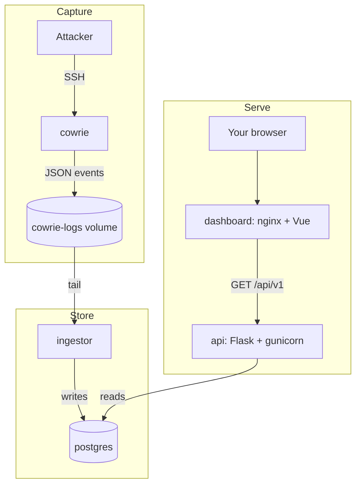

# Honeywatch

  

[Live dashboard](https://honey.piotrkrzysztof.dev)

Run your own SSH honeypot and watch what the internet does to it.

## What It Is

Honeywatch is an SSH honeypot with an analytics pipeline attached. A
[Cowrie](https://github.com/cowrie/cowrie) honeypot answers SSH pretending to be
a neglected CentOS box. An ingestor tails Cowrie's JSON event log into
PostgreSQL. A read-only Flask API serves aggregates over that data, and a Vue
dashboard turns them into a world map, an activity heatmap, credential
leaderboards and per-session replays.

The whole thing is five containers on one Docker network. Simplest
configuration would include the following:

1. Clone the repo onto a VPS or a spare machine;
2. Give the port 22 to the honeypot;
3. Keep the dashboard bound to loopback;
4. Look at it through a tunnel.

A public instance runs at [honey.piotrkrzysztof.dev](https://honey.piotrkrzysztof.dev).

## How It Fits Together

Cowrie and the ingestor never talk directly. They share a volume, and the
ingestor tails `cowrie.json` out of it.

## Where to Start

-   :material-rocket-launch: **Quick Start**

    ---

    Bring the five containers up on your laptop and see the dashboard

    [Quick Start](getting-started/quick-start.md)

-   :material-server: **Deploy the Stack**

    ---

    Put it on a real machine: what to publish, what to keep on loopback

    [Deploy the Stack](self-hosting/index.md)

-   :material-sitemap: **How It Works**

    ---

    The pipeline in detail: event parsing, schema, geolocation, redaction

    [How It Works](architecture/index.md)

-   :material-api: **REST API**

    ---

    Every endpoint, plus the self-hosted Swagger UI and ReDoc

    [REST API](reference/api.md)

## What It Captures

Login attempts, the commands attackers type, hashes of anything they download,
SSH client versions and key-exchange fingerprints, offered public keys, and
port-forward requests. Everything else Cowrie emits is dropped.

The API is read-only and never returns a source IP address. Addresses are kept in
the database for geolocation and counting distinct sources, nothing more.

!!! note "You are collecting other people's data"
    A honeypot records credentials people type and binaries they upload. Whether
    that is fine where you live is your call to make before you expose it.

## License and Attributions

Honeywatch is MIT licensed. [Cowrie](https://github.com/cowrie/cowrie) is a
separate upstream project with its own license.

This product includes GeoLite Data created by MaxMind, available from
[maxmind.com](https://www.maxmind.com). Country boundaries are made with
[Natural Earth](https://www.naturalearthdata.com/).
